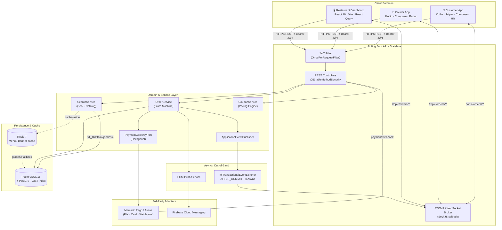
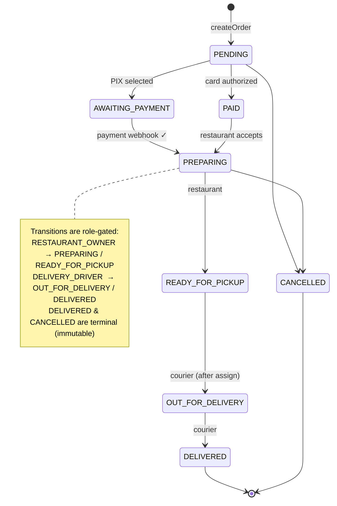

# Pratto Delivery — Technical Case Study

> A multi-tenant, real-time food-delivery and restaurant-management platform (SaaS), built as a four-surface ecosystem on a Spring Boot core with PostGIS-backed geospatial search, an event-driven notification pipeline, and a pluggable payment layer.

---

## 🎯 High-Level Overview

**Pratto Delivery** is a vertically integrated delivery ecosystem — the engineering equivalent of running iFood, a restaurant POS, and a courier dispatch system on a single backend. It is not a single app but a **monorepo of four coordinated surfaces** sharing one API contract: a customer mobile app (Kotlin/Jetpack Compose), a courier mobile app (Kotlin/Jetpack Compose), a restaurant management web dashboard (React 19), and a stateless Spring Boot API that orchestrates all of them. The platform takes an order from discovery (geospatial restaurant search) through checkout (multi-method payment), kitchen acceptance (a real-time Kanban / Kitchen Display System), and last-mile dispatch (courier radar + live tracking) — closing the loop with WebSocket and push notifications at every state transition.

The business impact is the *consolidation* of three normally separate products. A restaurant owner onboards once and immediately gets a sales dashboard, a dynamic menu with add-on modifiers, coupon campaigns, delivery-zone pricing, business-hour automation, and a manual POS for phone/WhatsApp orders — all isolated per tenant. The customer gets sub-second menu loads (Redis-cached), accurate "restaurants near me" results (geodesic PostGIS queries), and live order tracking. The engineering challenge is doing this **without data leaking between tenants, without the checkout request blocking on slow third parties, and without losing money to floating-point rounding** — the kind of constraints that separate a demo from a production SaaS.

---

## 🧩 Business & Technical Challenges

The domain logic in the code reveals the real-world problems this system was built to solve:

- **Strict tenant isolation (the "1-to-1" guarantee).** Restaurant A's orders, menu, coupons, and revenue must *never* be visible to Restaurant B. Every repository query is scoped by `restaurantId` or `ownerId`, and every mutation re-validates ownership server-side before acting.
- **Order lifecycle as a guarded state machine.** An order moves through eight states across three actor types (customer, restaurant, courier). The wrong actor must not be able to force the wrong transition (a courier cannot mark an order `PREPARING`; a restaurant cannot mark it `DELIVERED`), and terminal states must be immutable.
- **Real-time, multi-party coordination.** When a customer places an order, the restaurant's kitchen screen must light up instantly; when the kitchen advances a status, the customer's tracking screen and the courier's app must update — all without polling.
- **Money correctness.** Subtotals, add-on pricing, percentage/fixed coupons, delivery fees, and minimum-order rules must compute exactly, with discounts never exceeding the cart value and totals never going negative.
- **Resilience to third-party latency and failure.** Payment gateways, push services (FCM), and the cache layer are all external. None of them is allowed to break a checkout or take down a read path.
- **Geospatial discovery.** "Show me open restaurants within X km" must be a real geodesic distance on the Earth's surface, not a naive bounding box — and it must be indexed to stay fast.

---

## 🏛️ System Architecture

### Order Lifecycle (Guarded State Machine)

---

## ⚙️ Under the Hood (Tech Stack)

| Layer | Technology | Why it fits this system |
|-------|-----------|------------------------|
| **API Core** | Java 17/21, Spring Boot 3.5 | Spring's transaction management, declarative security, and mature ecosystem are the right call for a money-handling, multi-tenant transactional core where correctness beats novelty. |
| **Persistence** | PostgreSQL 16 + **PostGIS** (Hibernate Spatial) | A single engine that does both ACID transactions *and* first-class geospatial indexing (GIST). No need to bolt on a separate geo service — `ST_DWithin` runs in-database against an indexed `geometry(Point, 4326)`. |
| **Cache** | Redis 7 (Spring Cache abstraction) | Public read paths (menus, banners) are hot and rarely change. A cache-aside layer with per-cache TTLs absorbs that load off Postgres — with a custom `CacheErrorHandler` so a Redis outage degrades to DB reads instead of a 500. |
| **Real-time** | STOMP over WebSocket + SockJS fallback | The kitchen Kanban, customer tracking, and courier radar are inherently push-driven. STOMP gives topic-based fan-out (`/topic/orders/{id}`, `/topic/orders/restaurant/{ownerId}`) with a clean fallback path for restrictive networks. |
| **Auth** | Spring Security, **stateless JWT** (jjwt) | Stateless tokens let the same identity model serve three independent client apps without server-side session affinity — essential for horizontal scaling and for a mobile-first ecosystem. |
| **Payments** | Mercado Pago / Asaas via a **port interface** | Gateways are abstracted behind `PaymentGatewayPort` so PIX, tokenized cards, and webhook confirmations are swappable adapters, not hard dependencies. |
| **Migrations** | Flyway | Versioned, reproducible schema (incl. the PostGIS extension + spatial indexes) — the schema is code, reviewed in PRs. |
| **Web Dashboard** | React 19, Vite, TypeScript, **React Query**, Zustand, Radix/shadcn, Tailwind, Recharts | React Query owns server-state (the Kanban is live data, not local state); Zustand handles lightweight UI state; `@stomp/stompjs` wires the dashboard into the same WebSocket topics the mobile apps use. |
| **Mobile (Customer & Courier)** | Kotlin 2.0, Jetpack Compose (Material 3), Hilt, Retrofit/OkHttp, kotlinx.serialization, DataStore, Google Maps Compose | Native, declarative UI; Hilt for DI; an OkHttp interceptor injects the Bearer token; DataStore persists the JWT securely; Krossbow/STOMP drives live tracking. |
| **Notifications** | Firebase Cloud Messaging | Out-of-band push so users get status updates on a locked screen and restaurants get an audible alert on new orders. |

---

## 🔬 Engineering Hard Decisions

These are the decisions I would defend in a system-design interview — each one is visible in the code and each one trades simplicity for a property the business actually needs.

### 1. Decoupling notifications from the checkout transaction with `AFTER_COMMIT` + `@Async`

**The problem.** A checkout writes the order, persists an audit-trail row, talks to a payment gateway, *and* needs to notify the restaurant's kitchen screen. The naive version does all of this inline. That creates two bugs: (a) if the kitchen broadcast happens before the DB commits and the transaction then rolls back, you've notified the kitchen of a "phantom order"; and (b) the customer's HTTP response now blocks on the message broker and FCM, so any hiccup in those systems slows down *checkout itself*.

**The decision.** `OrderService.createOrder` does the minimum inside the transaction — persist and publish a domain event (`OrderCreatedEvent`) — and returns. A separate `@TransactionalEventListener(phase = AFTER_COMMIT)` annotated `@Async` does the fan-out. `AFTER_COMMIT` is the correctness guarantee: the kitchen is *never* told about an order that didn't commit. `@Async` is the performance guarantee: the notification runs on a dedicated thread pool, so a slow broker can never lengthen the customer's request. And it's deliberately *best-effort* — a broadcast failure is logged and swallowed, because a notification glitch must not retroactively fail an order that the customer already paid for. The event is published once, before the payment branches, so it covers every return path in the method.

> **Interview framing:** "I separated the *write* from the *side effects*. Writes are transactional and synchronous; side effects are post-commit and asynchronous. That single boundary kills both the phantom-notification race and the head-of-line blocking on third parties."

### 2. Tenant isolation enforced at the query layer, not the application layer

**The problem.** In a SaaS where every restaurant is a tenant, the most expensive bug class is a cross-tenant data leak — Restaurant A pulling Restaurant B's orders or editing B's menu. Filtering in the service layer ("fetch all, then drop the ones that aren't mine") is both slow and one forgotten check away from a breach.

**The decision.** Isolation is pushed *down into the repository signatures*. Queries don't fetch-then-filter; they're scoped at the source: `findByRestaurantIdAndStatusIn(...)`, `findByIdAndDeliveryDriver_Email(...)`, `findByIdAndRestaurant_Owner_Id(...)`. A courier requesting a delivery they aren't assigned to gets *nothing back from the database* — the ownership predicate is part of the `WHERE` clause, so there is no row to leak. Mutating paths add a second belt-and-suspenders check (`updateStatus` re-verifies `order.getRestaurant().getOwner().getId()` against the authenticated user before allowing a transition). The roadmap explicitly treats this as an auditable invariant — every custom query *must* carry the tenant key.

> **Interview framing:** "I treat the tenant key as part of the query's identity, not an afterthought. The database returns only rows the caller is entitled to, which makes the isolation property a structural guarantee rather than a discipline I have to remember in every endpoint."

### 3. Geodesic search inside the transactional database, not a separate search service

**The problem.** "Find open restaurants within X km of the user." Computing distance with planar math (treating lat/long as a flat grid) produces meaningfully wrong results, and scanning every restaurant per request doesn't scale.

**The decision.** Restaurant location is a `geometry(Point, 4326)` column with a **GIST spatial index**, and the proximity query casts to `geography` so `ST_DWithin` and `ST_Distance` compute *true geodesic distance on the Earth's surface*, ordered nearest-first. Keeping this in PostgreSQL — rather than introducing Elasticsearch or a geo microservice — means the geospatial filter participates in the same consistent, transactional store as everything else, with one fewer system to operate and keep in sync. SRID 4326 is enforced for GPS compatibility, and the radius is expressed in real meters.

> **Interview framing:** "I didn't reach for a separate search cluster because Postgres already does indexed geodesic queries correctly. Adding a second datastore would have bought me operational complexity and a sync problem to solve a problem the database already solves."

### 4. A pluggable payment port + idempotent webhook reconciliation for asynchronous money

**The problem.** PIX payments confirm *asynchronously* — the customer places the order, but the money lands seconds-to-minutes later via a gateway callback. Card payments confirm inline. And the payment provider itself shouldn't be welded into the domain.

**The decision.** Payments sit behind a hexagonal `PaymentGatewayPort` interface (with a sensible `default` method for the card-token overload), so Mercado Pago and Asaas are *adapters*, not dependencies the order logic knows about. The state machine models the async reality directly: a PIX order parks in `AWAITING_PAYMENT` and only advances to `PREPARING` when the gateway's webhook arrives. That webhook handler is **defensive and idempotent** — it parses an `ORDER_`-prefixed external reference, and only acts if the order is *still* `AWAITING_PAYMENT`, so a duplicated or replayed webhook (which gateways do send) can't double-advance an order or re-trigger notifications. The same callback path doubles as the seller-activation hook for onboarding payments. Pricing correctness is handled separately and rigorously: all money is `BigDecimal(10,2)`, coupon discounts use `HALF_UP` rounding, discounts are capped at the subtotal, and the final total is floored at zero.

> **Interview framing:** "Async money forced me to make the gateway a port and the order a state machine. The webhook is the source of truth for PIX, so I made it idempotent and status-guarded — replays are a normal event, not an edge case, and the domain never trusts a callback blindly."

---

## 🗺️ Beyond the Core

The same foundations extend into the operational depth a real restaurant needs: a manual **POS** for phone/WhatsApp orders that drops straight onto the live Kanban; **dynamic categories, business hours, and delivery zones** per tenant; **coupon campaigns** (fixed/percentage with min-order and expiry rules); **thermal-printer-friendly** kitchen tickets; **courier dispatch** with assignment and live location; a **sales analytics** dashboard; and image upload for store branding. Each was added as an isolated, tenant-scoped capability on top of the architecture above — which is the real test of whether the foundations were the right ones.
